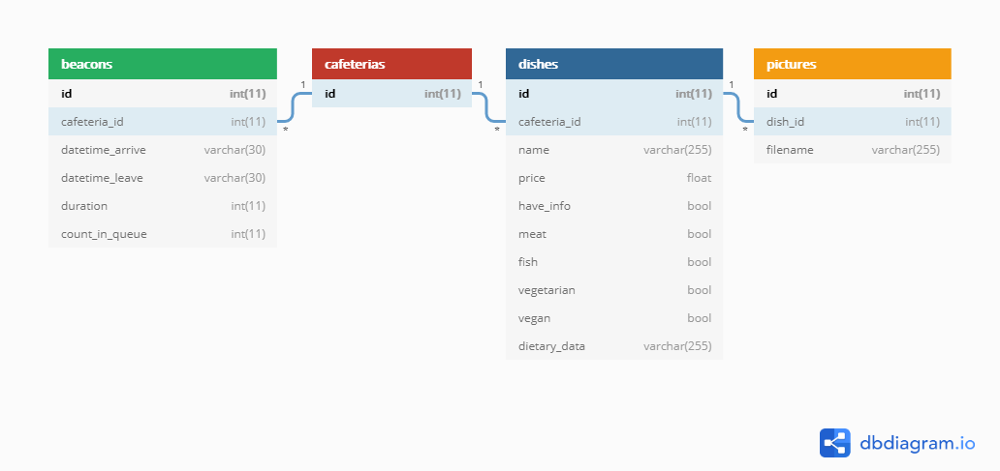

# FoodIST-Server: Finding food on campus 
 
FoodIST server module, providing a REST API HTTPS server for Mobile and Ubiquitous Computing class @ Instituto Superior Técnico, Lisbon, Portugal.

Meant to be used with the [FoodIST Android application](https://github.com/geckoflume/FoodIST), it provides ability to crowdsource cafeteria menus, dishes pictures and queue wait times.

More information: https://fenix.tecnico.ulisboa.pt/disciplinas/CMov4/2019-2020/2-semestre

*Group 23*

## Features

- Fetch cafeterias
- Fetch menus
- Fetch/add/delete/update the queue wait duration for each user
- Fetch/add/delete/update dishes
- Fetch/add/delete picture dishes
- Supports SSL/TLS
 
For usage, please read [How to use / Endpoints](#how-to-use--endpoints).  
This project is deployed on [https://data.florianmornet.fr/api/](https://data.florianmornet.fr/api/), feel free to give it a try!

## TODO

- Add authentication

## Specifications

This web application is written in PHP 7, built around Silex micro-framework for routing (lighter than the whole Symfony package).  
Data are stored in a MySQL database and can be updated using HTTP methods.

### Database specification

## Prerequisites

- A web server, can be Apache, nginx...
- PHP >=7.2.5
- A MySQL/MariaDB database
- [Composer >=1.6.0](https://getcomposer.org/download/)

## How to setup

- Run `composer install`.
- Setup the [utils/PictureUploader.php] to define where the dish pictures will be stored.
- Setup the [utils/Database.php] using your database connexion data.
- Then, load the [init.sql] script in your corresponding database (eg: `mysql -u root -p foodist < init.sql`).
- Finally, configure your web server as follow

### How to configure Apache

- Check that your Apache configuration (eg: `/etc/apache2/apache2.conf`) has `AllowOverride` set to `All` for your server Directory
- Use the provided [.htaccess], and modify the `FallbackResource` rule according to the **absolute** app path

### How to configure other web servers

https://silex.symfony.com/doc/2.0/web_servers.html

## How to use / Endpoints 

The server will be started on https://localhost/, which is also the default base API url (if deployed in a subdirectory, do not forget to update the [.htaccess] file and [utils/PictureUploader.php] [accordingly](#how_to_setup)).

### Cafeterias

| Method                     | Endpoint                     | Example                     |
|:-------------------------- |:---------------------------- |:--------------------------- |
| GET                        | /api/cafeterias              | `/api/cafeterias`           |
| GET                        | /api/cafeterias/{id}         | `/api/cafeterias/1`         |
| GET                        | /api/cafeterias/{id}/beacons | `/api/cafeterias/1/beacons` |
| GET                        | /api/cafeterias/{id}/dishes  | `/api/cafeterias/1/dishes`  |

### Beacons

| Method                     | Endpoint                     | Example                                                               |
|:-------------------------- |:---------------------------- |:--------------------------------------------------------------------- |
| GET                        | /api/beacons                 | `/api/beacons`                                                        |
| POST                       | /api/beacons                 | `{"cafeteria_id": 12, "datetime_arrive": "2020-04-26T09:12:43.511Z"}` |
| GET                        | /api/beacons/{id}            | `/api/beacons/1`                                                      |
| PUT                        | /api/beacons/{id}            | `{"datetime_leave": "2020-04-26T09:12:43.511Z"}`                      |

### Dishes

| Method                     | Endpoint                     | Example                                                         |
|:-------------------------- |:---------------------------- |:--------------------------------------------------------------- |
| GET                        | /api/dishes                  | `/api/dishes`                                                   |
| POST                       | /api/dishes                  | `{"cafeteria_id": 12, "name": "Bacalhau à brás", "price": 1.4}` |
| GET                        | /api/dishes/{id}             | `/api/dishes/1`                                                 |
| PUT                        | /api/dishes/{id}             | `{"cafeteria_id": 2, "name": "Soup", "price": 0.8}`             |
| DELETE                     | /api/dishes/{id}             | `/api/dishes/1`                                                 |
| GET                        | /api/dishes/{id}/pictures    | `/api/dishes/1/pictures`                                        |

### Pictures

| Method                     | Endpoint                     | Example                                   |
|:-------------------------- |:---------------------------- |:----------------------------------------- |
| GET                        | /api/pictures                | `/api/pictures`                           |
| POST (multipart/form-data) | /api/pictures                | `{"dish_id": 12, "picture": <JPEG file>}` |
| GET                        | /api/pictures/{id}           | `/api/pictures/1`                         |
| DELETE                     | /api/pictures/{id}           | `/api/pictures/1`                         |

## Valuable resources

- REST basics in PHP:
    - https://www.univ-orleans.fr/iut-orleans/informatique/intra/tuto/php/rest-api-php.html
    - https://www.codeofaninja.com/2017/02/create-simple-rest-api-in-php.html
     
- How to upload a file using a REST web service:
	- https://stackoverflow.com/a/4083908
	- https://symfonycasts.com/screencast/symfony-uploads/storing-uploaded-file

- REST JSON auth:
 	- https://www.codeofaninja.com/2018/09/rest-api-authentication-example-php-jwt-tutorial.html
	 
- MySQL and JSON date formats:
   - https://stackoverflow.com/a/409305
   - https://xkcd.com/1179/
    
- Queuing theory
   - https://en.wikipedia.org/wiki/Queueing_theory

[utils/PictureUploader.php]: utils/PictureUploader.php
[utils/Database.php]: utils/Database.php
[init.sql]: init.sql
[.htaccess]: .htaccess